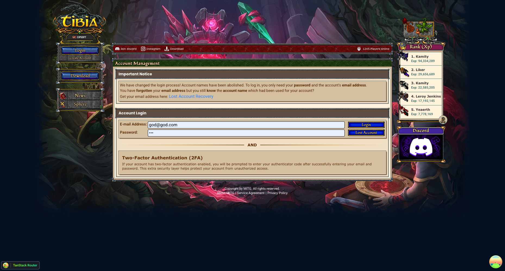

  <h1>MiForge</h1>
  
  
   
  
  
  
  
  
  
  

## O que é o MiForge?

MiForge é um portal/AAC inspirado no tibia.com, desenvolvido para facilitar o gerenciamento de contas, personagens, rankings e comunidade em servidores de Tibia. Com foco em multi-world, performance e experiência do usuário (DX), o MiForge oferece uma solução completa para administradores de servidores e jogadores.

## Exemplo

## Roadmap

| TODO | Status | PR |
|---|---|---|
| AAC (Front / API) |  | None
| Launcher |  | None
| Client |  | None
